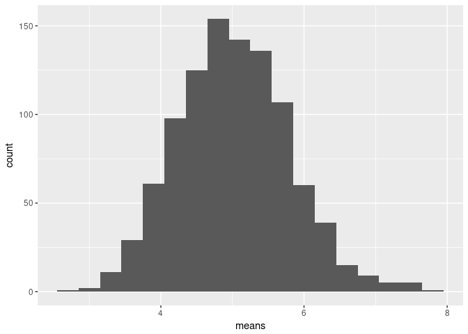

## Simulation Exercise


```r
if (!require("pacman")) install.packages("pacman")
pacman::p_load(knitr, dplyr, ggplot2, tidyr, hexbin, timeDate, grid, gridExtra, gtable)
```

We set the seed to ensure that the following analysis is reproducible


```r
set.seed(123)
```

We prepare a thousand repetitions of 40 samples drawn from an exponential distribution.


```r
rawdat <- rexp(40000, rate = 0.2)
matdat <- matrix(rawdat, 1000, 40)
```

From our simulated data we can obtain the sample mean:


```r
means <- apply(matdat, 1, mean)
sample_mean <- mean(means)
variance <- var(means)

print(variance)
```

```
## [1] 0.6088292
```

```r
df_means <- data.frame('means'= means)
ggplot(df_means, aes(means)) + geom_histogram(binwidth=0.3)
```

<!-- -->


## Inferential Data Analysis


